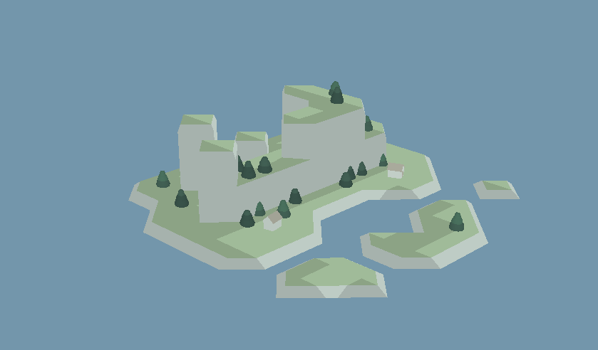

# wave-island



## About

Final project for IDATT2505.
A program that uses wave function collapse algorithm to generate an island.

# Compile and Run

## Linux Compile

Make sure GLU, GLUT and OpenGL is available.

```sh
git clone https://github.com/johannesHHM/wave-island
mkdir wave-island/build
cd wave-island/build
cmake ..
make
```

## Run

The program can be run by giving it zero arguments, and going thorugh configuration at runtime.

```sh
./island
```

Or you can supply the 5 needed arguments, in order,

- Size:     integer from 0 to 50 (recommend 6 - 15)
- Height:   integer from 0 to 50 (recommend 4 - 8)
- Houses:   integer from 0 and up (recommend 0 - 4)
- Trees:    any integer for trees, -1 for no trees (recommend 1)
- Seed:     any integer for seed, -1 for random seed (recommend -1)

```sh
./island 12 5 2 1 -1
```
The program will show a lightblue screen until the island has been generated.

# Controls

## Recommended Controls

<kbd>enter</kbd> regenerate island with new random seed

<kbd>space</kbd> stop island rotation

<kbd>←</kbd> rotate island clockwise 

<kbd>→</kbd> rotate island counter clockwise

<kbd>↑</kbd> move camera position up

<kbd>↓</kbd> move camera position down

## Funky Controls

<kbd>w</kbd> decrease camera Z position

<kbd>a</kbd> increase camera X position 

<kbd>s</kbd> decrease camera Z position 

<kbd>d</kbd> increase camera X position 


